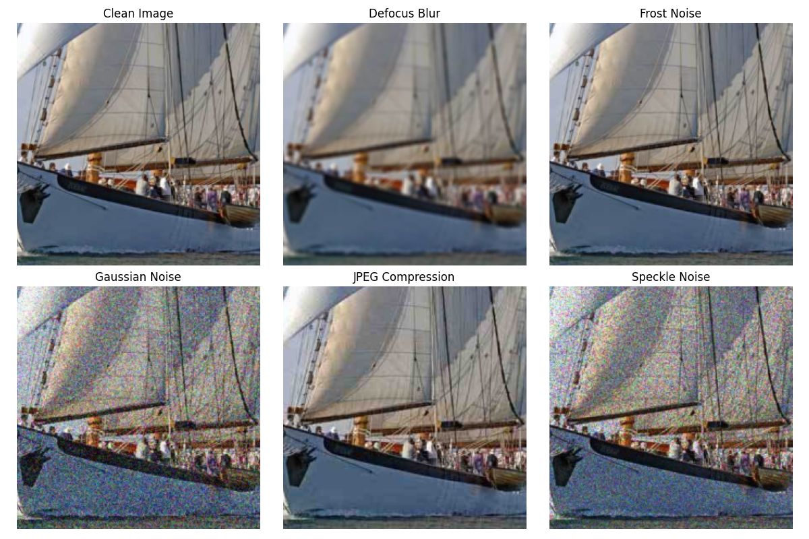
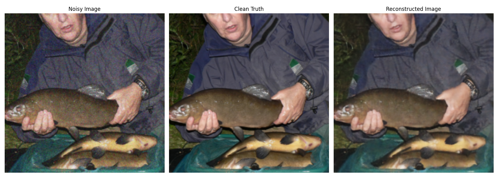

# Image Denoising with Variational Autoencoders

This repository implements a Denoising Variational Autoencoder (DVAE) based on the U-Net architecture to remove various types of image noise. The model is trained on a subset of ImageNet data with artificially added noise.


## Overview

This project:
- Uses a subset of ImageNet data
- Applies multiple noise types (defocus blur, frost, JPEG compression, Gaussian noise, speckle noise)
- Implements a Denoising Variational Autoencoder (DVAE) with U-Net architecture
- Provides visualization tools to evaluate denoising performance

The noising techniques are adapted from the paper code at [repository](https://github.com/hendrycks/robustness).


## Examples

### Noise Types

> Examples of original clean images with different types of applied noise




### Denoising Performance

> Denoising example with Gaussian noise: noisy image (left), clean original (middle), denoised using DVAE after 20 epochs (right)




## Setup

### Environment Setup
```bash
conda create -n <env_name> python=3.10.16
conda activate <env_name>
pip install -r requirements.txt
```

### Kaggle API Setup
This project downloads data directly from Kaggle. You need to set up your Kaggle API key:

1. Create a Kaggle account if you don't have one
2. Go to your account settings (https://www.kaggle.com/account)
3. Create a new API token (this will download a `kaggle.json` file)
4. Place the `kaggle.json` file in `~/.kaggle/` (Linux/Mac) or `C:\Users\<Windows-username>\.kaggle\` (Windows)
5. Ensure the file has restricted permissions: `chmod 600 ~/.kaggle/kaggle.json` (Linux/Mac)


## Usage

### Data Processing
To download and prepare the dataset with various noise types:
```bash
python train_data_process.py
```

### Training
To train the DVAE model:
```bash
python main.py
```

### Visualization
The code includes visualization tools to compare original, noisy, and denoised images to evaluate model performance.
```bash
python denoise_eval.py
```

## License
This project is licensed under the MIT License. See the [LICENSE](LICENSE) file for details.


## References

- [Auto-Encoding Variational Bayes](https://arxiv.org/abs/1312.6114)

- [U-Net: Convolutional Networks for Biomedical Image Segmentation](https://arxiv.org/abs/1505.04597)

- [ImageNet Dataset](http://www.image-net.org/)

- [Benchmarking Neural Network Robustness to Common Corruptions and Perturbations](https://arxiv.org/abs/1903.12261)

- [ImageNet Subset on Kaggle](https://www.kaggle.com/datasets/ifigotin/imagenetmini-1000)
